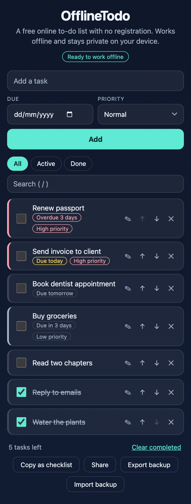
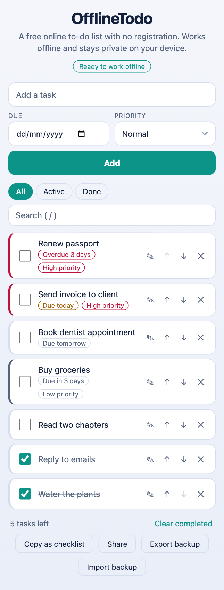

# OfflineTodo

A **free online to-do list with no registration**. It works offline, it's private, and your tasks stay on your own device. No account, no ads, no tracking.

**Live demo:** [umar8092.github.io/offlinetodo](https://umar8092.github.io/offlinetodo/)

| Dark | Light |
|---|---|
|  |  |

The app follows your device's light or dark setting.

## Features

- **Works offline.** After the first visit it opens and works with no connection.
- **No registration.** No account, email or password. Open it and start.
- **Private.** Tasks are saved only in your browser. Nothing is sent anywhere, and the app makes no network requests except loading its own files.
- **Installable.** Add it to your home screen or desktop and it opens like a normal app.
- **Due dates** with labels like "Due today", "Due tomorrow" and "Overdue 3 days".
- **Priorities** (Low, Normal, High).
- **Filters** (All, Active, Done) and **search**.
- **Reorder** by dragging, or with the up and down buttons (works on touch screens).
- **Edit** a task in place.
- **Undo** after deleting a task, clearing completed tasks or importing a backup.
- **Copy as checklist** or **Share** your list as plain text (`- [ ] task`, one per line) that pastes into Notes, Keep, Notion, Obsidian and more. On phones, Share opens the system share menu. It copies what you are looking at, so a filter or search applies.
- **Export and import** your tasks as a file, to back them up or move them to another device.
- **Keyboard friendly.** Enter adds a task, `/` jumps to search, Esc cancels an edit.

## Install it

- **Chrome, Edge (desktop and Android):** use the install icon in the address bar, or the browser menu, then "Install app".
- **Safari on iPhone and iPad:** tap Share, then "Add to Home Screen".

## About your data

Tasks live in your browser's local storage on this device. That means:

- They are private, but they are **not synced** between devices.
- Clearing your browser's site data **deletes them**. Use **Export backup** now and then.
- To move your tasks to another device, export them and import the file there.

## Run it yourself

No build step and no dependencies.

```bash
git clone https://github.com/umar8092/offlinetodo.git
```

Open `index.html` in your browser. Offline mode and install need the files served over `https` or from `localhost` (for example `python3 -m http.server`), because browsers only allow service workers there.

## How it works

- `core.js` holds the logic: cleaning and validating tasks, reading backup files, due dates and ordering. It has no page code in it.
- `script.js` builds the page. All task text is added as plain text, never as HTML, so nothing you type can run as code.
- `sw.js` is a service worker that saves the app files on your device and refreshes them in the background. If you add, remove or rename a file, update the file list and the `CACHE` name at the top of `sw.js`.

Open `test.html` in a browser to run the checks on the logic: task cleaning, backup import and export, due dates and ordering.

## License

[MIT](LICENSE). Free to use, copy, modify and share. Made by [Muhammad Umar](https://github.com/umar8092).
